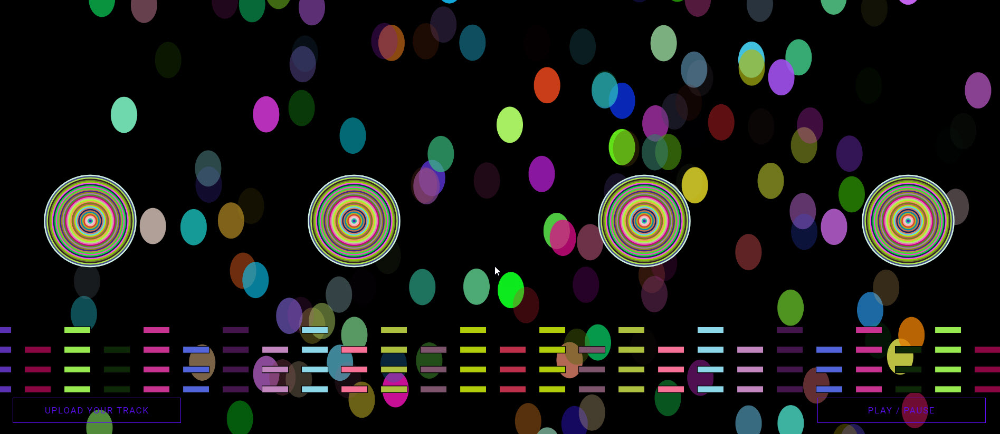

# Audio Visualizer 


Audio visualizer create visual representation of sound based on bass mid treble.

This is how you can visualize it



Project stack
  - HTML
  - CSS
  - JAVASCRIPT & P5.js framework
  - Node js 

# Installation 
```sh
$ npm install
$ npm start
`````````````````````````````
to view page browse via link http://127.0.0.1:8000/ upload a mp3 and enjoy 


### Development

Want to contribute? Great!

Make a change in your file and and project again with npm start.


